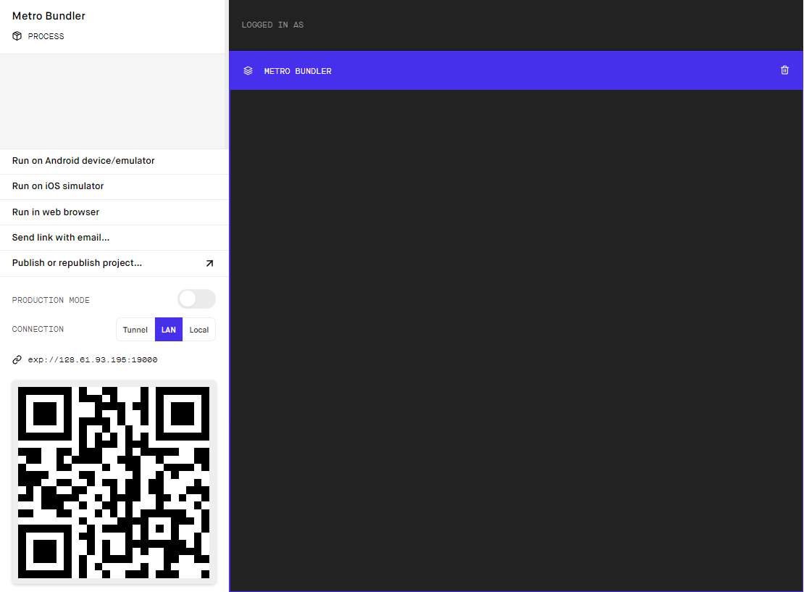

# 1102-FriendsoftheUrbanFoodForest

# Release Notes for the Friends of the Urban Food Forest Mobile App - Version 1.0 

## New Features

With the first release version of the Friends of the Urban Food Forest Mobile Application the following features are included: 

1. The ability for users to securely login into and/or register an account for the app through Firebase Authentication. 

2. To navigate the application there is a navigation bar located at the bottom of the screen. The navigation bar can lead to the home screen, the programs screen, the inventory screen, and the fundraising screen. 

3. There is a button located on the home screen that leads the user to a desired website or page. Can be used to direct a user to the Community Impact Survey. 

4. Administrators can add new posts to the home screen. Information that is displayed for the users on a post includes: title, description, and the time when a post was made. 

5. All users can view posts created by administrators. 

6. Button in top right of home screen leads users to their settings, where they can change their username and email address. 

7. If a user wishes to give money to the client, there are two fundraising options available: a donation page and a store page.  

8. If a user wishes to donate money with no merchandise purchase, they can use the donation button, which will lead the user to the Friends of the Urban Food Forest at Brown Mill’s website’s donation page. 

9. If a user wishes to add merchandise from the Friends of the Urban Food Forest to their shopping cart, they can do so from the application’s store page. 

10. Administrators can add a new product to the store in app simply by pressing the “Add Product” button and providing a name, image, description, and price. If an administrator wants to remove an item, there is a delete button located in all items. 

11. Administrators can add new tools to the inventory page, edit the number and availability of a tool, and delete existing tools from the database. 

12. All users can checkout tools that are available and in stock. Then, once they are done using the tool, they can check the tool back in. 

13. Administrators can create, edit, and delete programs. All users can view program details, and browse the events attached to them. 

14. Administrators can create, edit, and delete events. All users can view event details, and all events that belong to a specific program. 

15. Users can register for an event, and an administrator can view all participants for an event.

## Bug Fixes

With the release of version 1.0 comes numerous bug fixes! These include: 

1. There is a functioning mobile view for both IOS and Android. Previously development has been done using web application view due to conflicts with node imports and mobile views. 

2. When a specific program was selected all events would be displayed, regardless of which program they belonged to. Now, events will only be displayed in the program where they were created. 

3. Previously, when a user attempted to open their shopping cart after adding an item, the application would crash. Now a user can view items added to their cart without issue. 

4. On certain Android devices the back buttons to navigate to the previous page would not render in a location the user could interact with. A new margin prevents this issue from occurring. 

5. The application would load buttons intended for only admins regardless of the permissions of the logged in user. Now, features are originally displayed assuming a user is NOT an admin, and after checking if a user is an admin additional buttons are displayed as necessary. 

6. Users used to be able to check out a tool with the same ID. Now, when a tool whose ID has been checked out is attempted to be checked out again, an alert pops up warning the user. 

7. Saved usernames did not persist after logging out of the application. When a user saves their settings now, they can relog and see the changes persist.

## Known Bugs 
 

Although most functionality works as intended and many bugs have been fixed, there remain several known issues that the team has not yet had time to fix: 

1. Images currently do not display in the store. While the functionality exists in the code, it has been disconnected from the rest of the application until it works with the mobile view. 

2. Deleting an event that has participants crashes the application. 

3. Certain UI design elements are formatted incorrectly on certain devices. 

    * Programs page has smaller borders on larger devices 

    * Events page does not display UI elements correctly, such as back button and register 

    * Inventory page contains one column only when displaying tools instead of two columns on larger devices

____

# Install Guide Friends of the Urban Food Forest Mobile App - Version 1.0

## PRE-REQUISITES 

You must have node.js and expo-cli installed. See https://nodejs.org/en/ and https://docs.expo.dev/get-started/installation/. 

## DEPENDENCIES  

After installing node.js you can run “npm install” in the directory of the project on command prompt/terminal to install all the application dependencies. 

## DOWNLOAD 

No download is currently available for the production version of the application; however, the application will be uploaded to iOS and Google Play Store with client permission. 

The source code can be found and downloaded or forked from the [project’s repository](https://github.com/A-Novokshanov/1102-FriendsoftheUrbanFoodForest).

The code can be downloaded from Github using the following information from [Github’s documentation](https://docs.github.com/en/repositories/creating-and-managing-repositories/cloning-a-repository).

## BUILD 

There is currently no build available for the project. When the client begins working on getting the application setup for the app stores, a build will be made and published. 

## INSTALLATION 

The app can be run but not installed at this time because it has not yet been published. However, you can publish it by following these [instructions](https://docs.expo.dev/workflow/publishing/).

## RUNNING APPLICATION 

Run “npm start” in in the directory of the project on command prompt/terminal. You will be guided to a Metro Bundler interface:

Then you can either run the application on a simulator or on your actual phone for the left sidebar. To run it on a simulator you can either download the Android simulator or iOS simulator. To run it on a physical device you need to set the Metro Bundler connection mode to tunnel, install the Expo Go app from your app store, and scan the QR code in the Metro Bundler interface. 

## TROUBLESHOOTING 

One common error that may be faced is “this module does not exist” or “this package does not exist”. Resolving these errors is usually done by running “npm install <insert module/package name>. 

Another common error that may occur is “firebase is not connected”. This can be resolved by going into the Firebase console interface, updating the API keys, and inputting the new keys in the App.js file. 

If adding or editing functionality is not working for programs, events, or posts, it likely means that Google Firebase has updated or changed how they read and/or write database logic (as they do from time to time). You will have to go into the addPrograms(), editPrograms(), addEvents(), etc. methods and manually change them using the new [documentation](https://firebase.google.com/docs/firestore/quickstart). 
